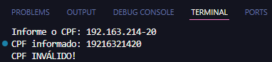

# Validação de CPF ⚖️

Este é um projeto desenvolvido em **Python** focado na validação de números de CPF (Cadastro de Pessoas Físicas). O script analisa se um CPF fornecido pelo usuário é matematicamente válido, processando a limpeza de caracteres e aplicando o algoritmo de verificação dos dígitos oficiais.

## 💻 Tecnologias

- Python 3.10+.
- Biblioteca `sys`.

## ⚙️ Instalação

- Certifique-se de ter o Python instalado (versão 3.10 ou superior).
- Baixe o arquivo Validacao_CPF.py.
- Abra o terminal na pasta do arquivo e execute:

```bash
python Validacao_CPF.py
```

## 🛠️ Funcionalidades

| Recurso | Descrição | Detalhes |
| :--- | :--- | :--- |
| **Limpeza de Dados** | Remove automaticamente pontos e traços da entrada. | Utiliza o método `.replace()` para tratar a string. |
| **Algoritmo de Cálculo** | Calcula os dígitos verificadores para comparação. | Realiza a soma ponderada dos 9 primeiros dígitos. |
| **Tratamento de Erros** | Identifica entradas que não sejam numéricas. | Utiliza blocos `try/except` para evitar interrupções. |
| **Validação de Sequência** | Rejeita CPFs compostos por números repetidos. | Identifica sequências inválidas (ex: 111.111.111-11). |

## 🕹️ Como usar

1. Execute o script e, quando solicitado, insira o CPF.
2. O programa aceita o CPF com formatação (xxx.xxx.xxx-xx) ou apenas números.
3. O sistema valida se a entrada possui exatamente 11 dígitos.
4. O software exibe na tela se o CPF é VÁLIDO ou INVÁLIDO com base nos cálculos matemáticos.

## 💡 Exemplo de uso

- Após executar o programa, o usuário deve informar o CPF
- Informando o CPF 192.163.214-20
- Após informar o CPF, o usuário visualiza se o CPF é válido:



## 🚀 Status do Projeto

✅ Concluído

## 👤 Autor

Feito por **Matheus Felipe Claudino de Santana**  
GitHub: https://github.com/matheuscsantana-arch
